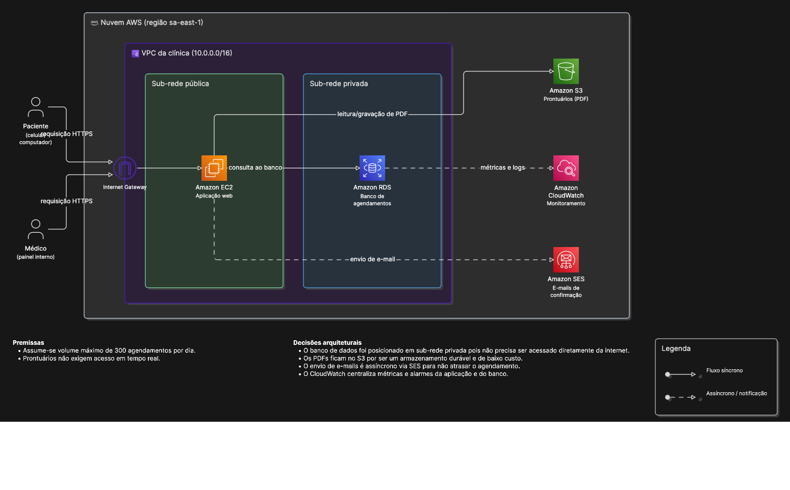

# Tarefa de Modelagem de Infraestrutura em Nuvem

## Diagrama de exemplo

Antes de iniciar, observe o diagrama abaixo para entender o **formato esperado** da entrega. O cenário representado é diferente do que você vai modelar — ele existe apenas para mostrar como organizar componentes, setas, premissas e decisões arquiteturais no diagrama.

---

Antes de começar a prática, preciso que você responda esse questionário:

🔗 **[QUESTIONÁRIO PRÉ-TESTE](https://forms.cloud.microsoft/Pages/ResponsePage.aspx?id=ZIEqXraHC0OsawjWIp5wWWFl4RM2c-RAnVcYxX2hlwpUNFY0QkNVRDdLWDgzR0RLUTM1MFBLQVBZSS4u)**

## Instruções ao participante

Você deve elaborar um diagrama de arquitetura para o sistema descrito abaixo usando o
Draw.io. O diagrama deve representar os principais componentes, as relações
entre eles e o fluxo principal de dados. Utilize os ícones AWS disponíveis no Draw.io quando
considerar que eles representam adequadamente a solução.

Você pode registrar até cinco premissas adotadas, escrevendo-as como texto dentro do
próprio arquivo do diagrama (por exemplo, em uma caixa de anotação). Além do diagrama,
escreva de 3 a 5 frases curtas justificando as principais decisões arquiteturais tomadas —
essa justificativa pode ser incluída no mesmo arquivo, em uma área separada do diagrama.

Não é necessário escrever código nem configurar recursos reais. O objetivo é representar
uma solução tecnicamente coerente para o cenário descrito.

O diagrama deve conter rótulos suficientes para identificar a função dos componentes. A solução não é
avaliada pela quantidade de serviços utilizados, mas pela coerência entre as características
do cenário e as decisões representadas.

Para seu auxílio na hora de desenhar o diagrama, utilize o guia de ícones AWS para o Draw.io:

https://henriqjmelo.github.io/tcc2/

**Tempo sugerido: 45 minutos.**

---

## Cenário

Uma concessionária de energia elétrica responsável pelo abastecimento de uma pequena vila
no interior de Minas Gerais mantém um sistema de gestão de contas de luz utilizado há mais
de duas décadas. O sistema permite que os proprietários de imóveis consultem suas contas e
seu histórico de consumo e realizem pagamentos, além de dar suporte à equipe administrativa
da concessionária na gestão de contratos, leituras e cobranças.

O acesso ao sistema é bastante concentrado: a maior parte dos proprietários consulta e paga
suas contas próximo ao quinto dia útil de cada mês, data de vencimento padrão, gerando um
volume de acessos muito superior ao restante do mês. Nos finais de semana, o volume de
acesso cai bastante, mas nunca chega a zero — mesmo aos sábados e domingos, moradores
continuam reportando falhas de fornecimento de energia pelo sistema, e esse serviço não
pode ficar indisponível. Uma parte relevante dos proprietários mora fora do Brasil ou possui
propriedades na região usadas esporadicamente, então o sistema é acessado de diferentes
países, em horários variados, por computadores e por celular.

O sistema guarda dados de contas que existem desde antes de sua própria criação, migrados
de um sistema anterior. Esses registros históricos raramente são consultados pelos
proprietários, mas precisam permanecer acessíveis para eventuais disputas ou solicitações
da concessionária. Cada proprietário só pode ver as contas e o histórico dos imóveis
vinculados ao seu próprio cadastro — não deve ser possível consultar dados de outro
proprietário. Quando um pagamento é feito fora dos meios digitais integrados (por exemplo,
uma transferência bancária avulsa), o proprietário pode anexar o comprovante em arquivo
diretamente pelo sistema, para análise posterior da equipe administrativa.

Além dos proprietários, a equipe da concessionária utiliza o sistema para cadastrar leituras
de consumo, gerar as contas mensais, revisar comprovantes anexados manualmente e emitir
relatórios de inadimplência. Essa equipe interna acessa funcionalidades que não ficam
disponíveis para os proprietários. Sempre que um pagamento é processado com sucesso, o
sistema informa o proprietário na hora e também envia uma notificação por e-mail confirmando
a quitação da conta.

O sistema também se conecta periodicamente com uma API do governo federal para validar
dados cadastrais dos proprietários, necessária para a emissão de notas fiscais de serviço.
Essa integração ocorre com um sistema externo à concessionária, fora do seu controle
direto, e envolve o tráfego de dados pessoais dos proprietários.

A concessionária já enfrentou, no passado, problemas em outros sistemas internos que
ficaram fora do ar por horas durante o pico do quinto dia útil, gerando reclamações e
chamados de suporte. Depois desses episódios, a diretoria passou a exigir que qualquer novo
sistema continue operando mesmo diante de falhas pontuais em algum de seus componentes,
sem perder dados já registrados, e que a equipe técnica seja capaz de perceber rapidamente
quando algo está funcionando fora do esperado.

A concessionária opera com orçamento público limitado, definido anualmente. Por isso, a
diretoria pediu explicitamente que a solução evite manter, o tempo todo, uma capacidade de
infraestrutura dimensionada para o pico do quinto dia útil, já que esse nível de uso está
longe de ser constante ao longo do mês.

---

## Envio do diagrama

Renomeie seus arquivos colocando o número de participante que você recebeu no lugar de `XX`:

- `participante_XX.drawio`
- `participante_XX.png`

Em seguida, faça o upload de **ambos os arquivos** na pasta abaixo:

🔗 **[LINK DO GOOGLE DRIVE]**

---

## Formulário de acompanhamento

Após concluir o diagrama e fazer o upload, preencha o formulário a seguir:

🔗 **[LINK DO GOOGLE FORMS]**

